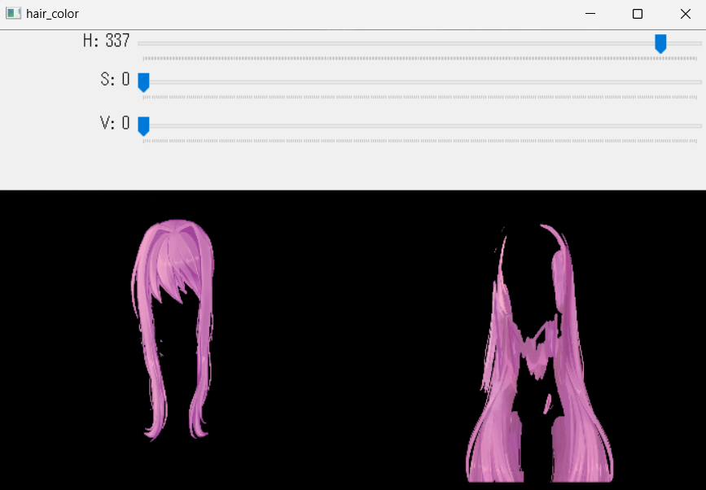

# MAS-Hair-Color-Change

Simple Python script with OpenCV to change spritepacks hair color in Monika After Story.

## Installation

### Windows simple version

Download haircolorchanger.zip in Releases and unzip it in your MAS folder at the location `game/`.

Launch `haircolorchange.bat` to execute the script.

### Linux/MacOS installation

Clone the repository: `git clone https://github.com/Rubiksman78/MAS-Hair-Color-Change.git`.

Install the requirements with `pip install -r requirements.txt`.

Launch the script with `python hair_color_change.py`

## Usage

The script will overwrite the hair files in the `game/mod_assets/monika/h` folder and make a backup of the original files as a file `hair_name-backup.png` in the same folder. If you want to restore the original hair color, just delete the modified files and delete the `-backup` in the name of the backup files.

It modifies the color by pair automatically, because for each haircut there are two files, one for the front and one for the back of the hair.

Example: `hair-down-front-backup.png` is the backup of `hair-down-front.png` and `hair-down-front.png` is the modified file. The same applies to the back of the hair.

To modify the color, you can set three trackbars:
- Hue: changes the color of the hair
- Saturation: changes the saturation of the hair
- Value: changes the brightness of the hair

